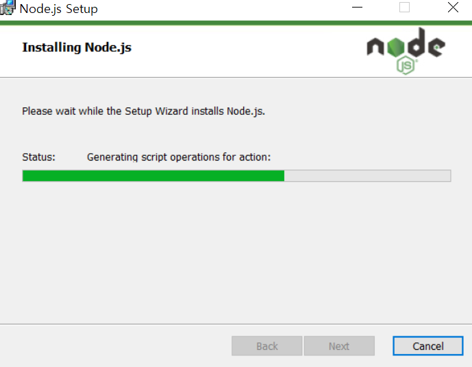

# Part.0 Javascript 실습 환경 구성

## Node.js 설치

Javascript를 사용하기 위해서는 node.js를 설치해야 합니다.

[node.js site](https://nodejs.org/en/)에 접속하여 node.js LTS 버전을 다운로드 합니다.

설치가 정상적으로 완료되었다면 아래와 같이 `npm -v` 및 `node -v` 명령어를 통해 버전에 대한 정보를 확인할 수 있습니다. (nodes.js를 설치했는데 npm도 함께 설치되는 ㄱ1적)

## VSCode 환경 설정

Javascript를 실행시키기 위해 `Code Runner` extension을 설치합니다.

그 다음 코드를 실행하면 정상적으로 실행되는 것을 확인할 수 있습니다.

## intelliJ 환경 설정

갓텔리제이는 node 설정 확인해보면 path가 바로 적용되어 있는 것을 확인할 수 있습니다.

코드도 당연히 정상적으로 실행됩니다.

